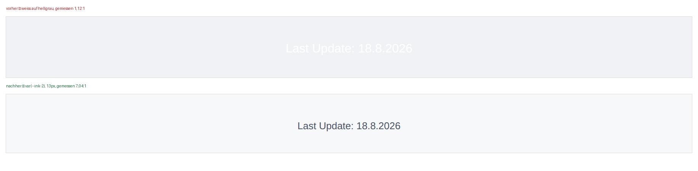

# Block 8 — die Fehlerliste

Sechs Commits, aufsetzend auf Block 7 (`main` = `91fd8a59`, PR #457).
Nichts davon ist gepusht.

```bash
bash redesign/offen/block8/merge-block8.sh .
```

Angenommen auf einem frisch geklonten Repo: **1157 JS-Tests** (vorher
1115), **373 Python** / 5 übersprungen, `!important` **3356 → 3347**.

---

## Vorab: was dieser Block *nicht* ist

Im Bericht zu Block 7 habe ich Block 8 als *„die Zusammenlegungen …
der größte Eingriff der ganzen Reihe"* angekündigt. Das war eine
Schätzung ohne Messung, und die Messung hat sie kassiert.

Die drei Deck-Gitter-Renderer (`renderCityLeagueDeckGrid` 375 Zeilen,
`renderCurrentMetaDeckGrid` 370 Zeilen, dazu der Past-Meta-Zweig) sind
nach Normalisierung der Datenraum-Präfixe zu **44,5 %** deckungsgleich
— 128 von rund 290 Zeilen geteilt, 146 von 173 abweichend. Das
Handbuch sagt *„nur 221 von ~350 Zeilen weichen ab"*; das stimmt nicht.
Eine Zusammenlegung wäre kein Aufräumen, sondern ein Neuschreiben, und
zwar an der Stelle, an der die Seite ihr Geld verdient. Nicht in einem
Block, nicht ohne dass du es vorher weißt.

Die zweite Ankündigung aus dem Handbuch ist ebenfalls hinfällig: der
Snapshot-Überschreiber zwischen Meta Binder und Custom Binder **ist
bereits repariert** (`computeDelta` ist im Code als persistenzfrei
dokumentiert).

Statt Ankündigungen also die Fehlerliste — und die war ergiebiger als
gedacht: von den sechs geprüften Einträgen waren **vier echt**, einer
**falsch diagnostiziert** und einer **kein Fehler**. Bei zweien war der
wirkliche Befund größer als der notierte.

---

## 1 · Top 100: 1,2 MB HTML für zweihundert Eingabefelder ohne Wirkung

Der Block *„🎯 Matchup Analysis – Top 100 Decks"* im Deck-Tab, gemessen
im Browser:

| | |
|---|---:|
| Tabhöhe gesamt | 16.950 px |
| davon dieser Block | 5.556 px (33 %) |
| Suchfelder darin | 200 |
| davon funktionsfähig | **0** |
| Tabellen darin | 200 |
| Zeilen | 1.033 |
| `outerHTML` | 1.199.003 Zeichen |

Zweihundert Suchfelder, an denen kein Ereignis hängt. Entfernt an
beiden Enden: clientseitig über `_dropTop100MatchupSection()` (läuft
**vor** `_sanitizeScraperHtml()`, sonst arbeitet die Bereinigung erst
das ganze Feld durch) und im Erzeuger
`backend/scrapers/limitless_online_scraper.py`, damit es beim nächsten
Lauf nicht zurückkommt.

Nachher: **11.364 px** (Desktop) / 14.029 px (Mobil), 3 Eingabefelder,
23 Tabellen.

---

## 2 · Die Typentabelle: drei falsche Felder, in drei Kopien, keine davon verglichen

Der stärkste Fund des Blocks. Das Handbuch notiert *ein* falsches Feld.
Es sind drei — und der Grund dafür ist die eigentliche Geschichte.

Dieselbe Tabelle steht an drei Stellen im Projekt:

| Ort | benutzt von |
|---|---|
| `js/app-side-quest-play.js`, fest im Code | Play-Panel |
| `data/champions_type_chart.json` | Schadensrechner, Matchup-Ansicht |
| `tests/unit/test-side-quest-play.js`, abgeschrieben | — |

Verglichen hat sie nie jemand. Sie widersprachen sich:

```
Geist -> Unlicht   war 2      richtig 0.5
Fee   -> Käfer     war 0.5    richtig 1
Fee   -> Feuer     fehlte     richtig 0.5
```

Die Feen-Zeile hatte die Käfer-Zeile abgeschrieben. Die JSON-Datei war
in allen drei Feldern richtig, der Code in allen drei falsch.

**Was der Nutzer sah**, gemessen gegen `data/pokemon_battle_data.json`:

| | |
|---|---:|
| Pokédex-Einträge mit Typen | 1.480 |
| davon mit falscher Schwächenliste | **125** (8,4 %) |
| falsch angezeigte Schwächen | 123 |
| fehlende Schwächen | 8 |
| im Panel tatsächlich gelistete Arten | 104 |
| davon betroffen | **11** |

Ein reines Unlicht-Pokémon stand mit „Ghost ×2" in der Liste, obwohl
Unlicht gegen Geist resistent ist. Geist/Unlicht stand auf ×4. Das ist
genau die Information, wegen der es das Panel gibt — 90 Sekunden
Teamwahl, und die Zahl ist falsch.

**Warum kein Test das finden konnte:** die Testdatei enthielt rund 950
Zeilen handkopierten Produktivcode. Sie bewies, dass die Kopie sich
verhält wie die Kopie. Sie lädt jetzt `js/app-side-quest-play.js`
wirklich (`new Function` statt `vm`, damit `deepStrictEqual` nicht an
Realm-Grenzen scheitert) und prüft die Tabelle gegen **zwei
unabhängige Instanzen**:

1. gegen `data/champions_type_chart.json`, alle 18×18 Felder
2. gegen eine von Hand getippte **Verteidigungs**-Tabelle,
   transponiert — eine wirklich andere Schreibweise, in der ein
   verrutschtes Feld nicht gleich falsch stehen kann

Gegenprobe: mit dem alten Wert wieder eingesetzt fallen zwei Tests mit
`Ghost->Dark: js=2 json=0.5`.

Der Code behält seine eigene Kopie, bewusst: das Panel wird am
Turniertisch gebraucht, eine fehlgeschlagene Anfrage darf keine leere
Schwächenliste ergeben. Eine Kopie ist harmlos, solange jemand sie
vergleicht.

---

## 3 · Eine Versteck-Klasse statt zwei, neunzehn Regeln statt einer

Das Handbuch: *„Best/Worst-Matchups für 0 von 60 Archetypen sichtbar —
Markup trägt `display-none`, Renderer entfernt nur `d-none",
`index.html:1296`.*

**Die Diagnose stimmt nicht mehr.** Im Deep-Dive-Modus zeigt der
Abschnitt sauber: vier Archetypen durchgeklickt, `display=block`,
520 px hoch, 5 Zeilen je Tabelle. Der zweite Renderpfad (der
CSV-Rückfall) entfernt seit einer späteren Reparatur beide Klassen.

**Die Ursache steht aber noch da.** Der erste Renderpfad
(`app-current-meta-analysis.js:2786`) entfernt weiterhin nur `d-none`.
Repariert wurde damals das Symptom im zweiten Pfad, die Falle im ersten
blieb liegen. Und der Grund, dass es diese Falle überhaupt geben kann:

| | |
|---|---:|
| `.d-none` | 193 Verwendungen |
| `.display-none` | 96 Verwendungen |
| CSS-Regeln, die eine davon erklären | **19** |
| davon Wort für Wort identisch in `ui-components.css` | 8 |

Neunzehn Regeln für „unsichtbar". Jetzt: **ein Name, eine Regel**, und
sie steht bewusst am Dateiende. `.d-none` hat Gewicht (0,1,0) und
`!important` — genau wie `.flex`, `.display-block`, `.flex-between` und
die Grid-Utilities in derselben Datei. Wer später steht, gewinnt.
`class="d-none flex"` war bisher **sichtbar**. Wer etwas versteckt,
meint es.

Gemessen gegen `HEAD`, Playwright, Service Worker blockiert, alle acht
Tabs: **10.562 Elemente verglichen, 0 verändert** — auf 1440×900 und
auf 390×844.

`tests/unit/test-eine-versteckklasse.js` hält neun Punkte fest, darunter
zwei, die die ursprüngliche Falle direkt adressieren: keine Klasse darf
gesetzt werden, die nie wieder entfernt wird, und keine Versteck-Klasse
aus dem Markup darf ohne Gegenstück in `js/` bleiben.

---

## 4 · Drei globale Namen, sechs Funktionen, drei davon unerreichbar

Nicht im Handbuch, beim Nachgehen von Eintrag *„getEmptyStateHtml
doppelt"* gefunden — und größer als notiert.

**633 Funktionen** in `js/` stehen auf oberster Ebene, also alle im
selben globalen Namensraum. Drei Namen waren doppelt vergeben. Wer
später lädt, gewinnt still — und zweimal war die verlierende Fassung
genau die, für die der aufrufende Code geschrieben war.

### `getEmptyStateHtml`

```
app-utils.js:1487        nimmt {title, body, cta, icon}   VERLOREN
app-city-league.js:2734  ohne Argumente, fester Text
```

Die leere Wunschliste und die leere Tauschliste rufen
`window.getEmptyStateHtml({...})` mit Titel, Text und Knopf auf. Sie
landeten in der City-League-Fassung, die alles davon ignoriert. Was der
Nutzer stattdessen las, im Browser nachgestellt:

> **No Data** — No data found — No tournament data available for this
> filter combination.

Das ist die erste Begegnung eines neuen Nutzers mit diesen beiden Tabs.

Drei weitere Aufrufstellen riefen bewusst ohne Argumente — sie waren
für die City-League-Fassung geschrieben. Sie sagen jetzt, was sie
meinen, und unterscheiden dabei zwei Lagen, die vorher denselben Satz
bekamen: *„gar keine Daten"* und *„der Filter lässt nichts übrig"*. Das
eine löst man mit Warten, das andere mit einem Klick.

### `escapeHtml`

```
app-utils.js:1397                  3 Zeichen, null -> ''       VERLOREN
app-current-meta-analysis.js:2598  5 Zeichen, null -> "null"
```

Die strengere gewann, das war Glück. Aus `escapeHtml(null)` wurde aber
der sichtbare Text `"null"`. Es gibt jetzt eine Fassung: fünf Zeichen,
und leer bleibt leer.

### `filterPastMetaCards`

Die verlierende las `#pastCardSearchInput` und `#pastCardCount` — beide
gibt es im Markup nicht. 18 Zeilen, die aussahen wie eine Suchfunktion.
Entfernt.

Ein Linter fällt darauf nicht herein: jede Datei ist für sich gültig.
Nur der Blick über alle Dateien zeigt es, und den macht jetzt
`tests/unit/test-globale-namen.js` bei jedem Lauf.

---

## 5 · Zwei Versprechen, die die Seite nicht gehalten hat

### Der Knopf, der nichts tat

`js/draw-simulator.js:190` rief beim Klick auf eine Kombo-Marke
`_toggleComboTarget(name)` auf. **Diese Funktion gibt es in keiner
Datei des Projekts.** Der Titel der Marke sagte dabei „zum Entfernen
klicken". Jeder Klick war ein `ReferenceError`.

```
vorher   2 Marken, Klick -> ReferenceError, weiterhin 2 Marken
nachher  2 Marken, Klick -> 1 Marke, Auswahlfeld geleert, kein Fehler
```

Entfernen heißt dabei zweierlei: aus `_comboTargets` raus **und** das
Auswahlfeld leeren, das den Namen gesetzt hat. Sonst holt der nächste
`onComboDropdownChange()` ihn sofort zurück.

Die Marke ist jetzt ein `button` statt eines `span` — anklickbar heißt
mit der Tastatur erreichbar, mit `aria-label` und Fokusrahmen. Ihr
Aussehen liegt in `.draw-sim-combo-badge` statt in einer
Stil-Zeichenkette im Skript.

Der allgemeinere Test: jede im Modul gerufene `_`-Funktion muss im
Modul auch definiert sein.

### Die unsichtbare Fußleiste

`.footer` stand auf `color: white`, der Seitenhintergrund ist hell.
Gemessen **1,12:1**. Der Text lautet *„Last Update: <Datum>"* — die
einzige Stelle der ganzen Seite, an der steht, wie frisch die Zahlen
sind. Auf Mobil kam ein `font-size: 0.9em` obendrauf, das sich gegen
die Elternschrift auf gemessene **10,8 px** herunterrechnete.



**Warum das nie auffiel** steht in `css/pokeball-menu.css`. Eine Datei
über ein Menü erklärte dort `body { font-family, background-color,
color }` für die ganze Seite — und sie lädt nach `styles.css`. Der
Seitenhintergrund kam deshalb aus `--bg-body` (`#f0f2f5`) statt aus dem
Token `--surface-0`, und der Dunkelmodus in `tokens.css` konnte den
Hintergrund **nie erreichen**. Die Seite hat jetzt eine `body`-Regel,
und die steht in `styles.css`.

| | Kontrast | Schrift Desktop / Mobil |
|---|---:|---:|
| vorher, hell | 1,12:1 | 16 px / 10,8 px |
| nachher, hell | **7,04:1** | 13 px / 13 px |
| nachher, dunkel | **10,68:1** | 13 px / 13 px |

Abgleich der berechneten Stile gegen `HEAD`, alle acht Tabs, beide
Breiten: **10.546 Elemente gleich, 16 verändert** — das sind `FOOTER`
und `#last-update` auf je acht Tabs, also genau die beiden gemeinten.

---

## 6 · Druckliste: ein Schalter, der ein Nichts unterdrückte

Das Handbuch führt `saveProxyQueue()` als leeren Rumpf und damit als
Fehler. **Er ist keiner.** Die Druckliste ist bewusst nur für die
aktuelle Sitzung gedacht; `clearLegacyProxyQueueStorage()` räumt den
alten Eintrag `proxyQueueV1` beim Laden aktiv weg. Das sage ich lieber,
als eine Reparatur zu erfinden.

Was bleibt, ist das Beiwerk: durch sechs Aufrufstellen lief ein
Schalter `suppressPersist`, der genau dieses Nichts unterdrückte, und
`firebase-collection.js` prüfte vor dem Aufruf noch, ob es die Funktion
überhaupt gibt. Zehn Stellen, die aussahen, als gäbe es eine
Speicherung — genau die Falle für den Nächsten, der darauf aufbaut.
Beiwerk entfernt, der Grund steht als Kommentar an der einen
verbliebenen Stelle. Verhalten im Browser gegen `HEAD` geprüft:
identisch.

**Offene Produktfrage, nicht von mir entschieden:** wenn jemand eine
60-Karten-Druckliste zusammenstellt und die Seite neu lädt, ist sie
weg. Soll sie das?

---

## Was offen bleibt, mit Begründung

| offen | warum |
|---|---|
| Die drei Deck-Gitter-Renderer zusammenlegen | 44,5 % Deckung gemessen. Neuschreiben, nicht Aufräumen. Eigener Block, mit deinem Ja vorher. |
| Die restlichen 44 spaltensetzenden Regeln | `.tier-deck-grid` 3 Spalten bei 82 px, `.top-cards-grid` 4 bei 69 px. Gleiche Sorte wie Block 5/6, aber ohne Messreihe. |
| Meta Binder + Custom Binder zusammenlegen | Produktentscheidung, keine Aufräumarbeit. |
| Vergleichs-Komponente, Rechner als Modus, Side Quest 7→5 Untertabs | dito |
| Dunkelmodus | `tokens.css` hat ihn vollständig, aber **nichts setzt `data-theme`**. Er ist unerreichbar. Nach Punkt 5 würde er jetzt wenigstens den Seitenhintergrund treffen. |
| `pytest` verändert `data/card_text_resolution.csv` | Seit Etappe 0-2 bekannt. `weekly-full-update.yml` committet mit `git add -A`. Jedes Merge-Skript setzt die Datei zurück. Gehört in einen eigenen kleinen PR. |

## Neue Tests

| Datei | prüft |
|---|---|
| `test-side-quest-play.js` (umgebaut) | lädt das echte Modul statt 950 Zeilen Abschrift; Typentabelle gegen JSON **und** gegen transponierten Kanon |
| `test-eine-versteckklasse.js` | eine Versteck-Klasse, eine Regel, hinter allen Layout-Utilities |
| `test-globale-namen.js` | kein Funktionsname zweimal auf oberster Ebene |
| `test-kombo-marken.js` | jede gerufene `_`-Funktion existiert; Marke ist bedienbar |
| `test-fussleiste-und-koerper.js` | eine `body`-Regel; Fußleiste nicht weiß, nicht unter 13 px |
